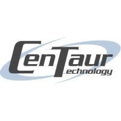
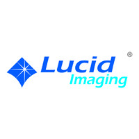

# Professional Experience

## Academic

### Undergraduate Teaching Assistant

{ align=left width=20% style=margin:1em;margin-left:0;margin-top:1.8em }

* Past Positions:
    * Computer Architecture (*Dr. Yale Patt, UT Austin, Fall 2020*)
    * Introduction to Computing (*Dr. Yale Patt, UT Austin, Fall 2019*)
    * Introduction to Embedded Systems (*Dr. Jon Valvano, UT Austin, Spring 2019*)
    * Introduction to Computing (*Dr. Ramesh Yerraballi, UT Austin, Fall 2018*)
* Responsible for holding review sessions, office hours, grading, and constructing
 assignments/exams
* Provide guidance to students in determining their fields of interest 

 
 
## Industry

### Apple Inc.

{ align=left width=20% style=margin:1em;margin-left:0;margin-top:1.8em }

&nbsp; :material-account-tie-hat: &nbsp;***GPU Design Verification Intern***
&emsp;|&emsp; :octicons-location-16: *Austin, TX*

* Improved speed and coverage of address generation test set for GPU memory hierarchy
* Developed a library to allow reproducability of tests for targeted constraint testing
* Bringup of UVM testbenches for memory hierarchy

&nbsp; :material-file-code-outline: &nbsp;*SystemVerilog*, &nbsp;*Python*
&emsp;|&emsp; :material-tools: &nbsp;*UVM*

 
### Centaur Technology Inc.

{ align=left width=20% style=margin:1em;margin-left:0;margin-top:0.3em }

&nbsp; :material-account-tie-hat: &nbsp;***CPU Design Verification Intern***
&emsp;|&emsp; :octicons-location-16: *Austin, TX*

* Created a real-time debugging tool to monitor chip performance using ELK stack
* Tested and debugged AVX-512 instructions
* Improved pre-silicon test tools for register file verification
* DevOps work: CI/CD, bugreport database management and front-end scripting

&nbsp; :material-file-code-outline: &nbsp;*Python*, &nbsp;*Ruby*, &nbsp;*SystemVerilog*
&emsp;&emsp; :material-tools: &nbsp;*ELK*, &nbsp;*Jenkins*, &nbsp;*Docker*, &nbsp;*Traefik*

 
### Qube Cinema Inc.

{ align=left width=20% style=margin:1em;margin-left:0;margin-top:4.6em;margin-bottom:4.6em }

&nbsp; :material-account-tie-hat: &nbsp;***Software Engineering Intern***
&emsp;|&emsp; :octicons-location-16: *Chennai, India*

* Worked on iCount - a commercial product to count seat occupancy in theaters
    * Reworked the CNN in Keras using transfer learning on ResNet50 model
    * Added augmentation to account for poorly lit environmental conditions
    * Accuracy of 92% on uncorrelated test set

&nbsp; :material-file-code-outline: &nbsp;*Tensorflow*, &nbsp;*Python*
&emsp;&emsp; :material-tools: &nbsp;*Keras*

 
### Lucid Imaging Pvt. Ltd.

{ align=left width=20% style=margin:1em;margin-left:0;margin-top:0.8em }

&nbsp; :material-account-tie-hat: &nbsp;***Machine Learning Intern***
&emsp;|&emsp; :octicons-location-16: *Bangalore, India*

* Designed a CNN model to detect polypropylene in fast-flowing industrial cotton
    * Tranfer learning performed on VGG-16 deep learning model in Keras
    * Dealt with highly imbalanced class labels in training set
    * Achieved 96% test accuracy with no false positives

&nbsp; :material-file-code-outline: &nbsp;*Tensorflow*, &nbsp;*Python*
&emsp;&emsp; :material-tools: &nbsp;*Keras*

 
 
## Certificates

* **Machine Learning**: *Andrew Ng* (Coursera)
* **Android App Development**: *CMS IT Services*

 
 
