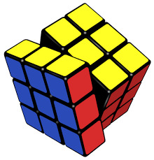
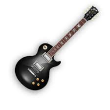
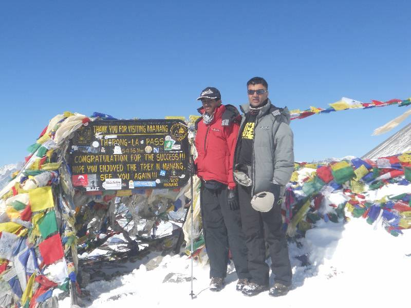
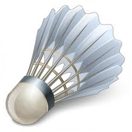

## Speedcubing

{ align=left width=15% style=margin:1em;margin-left:0;margin-top:0.3em }

* I started serious speedcubing in high-school and competed in a variety of 
local/national competitions 
* Developed a variety of my own unique algorithms for to ease memorization and speedsolving.
Solved 3x3 (blind/OH), 4x4, 5x5, megaminx... 

Here is my [**official profile**](https://www.worldcubeassociation.org/persons/2014RAME04)

My notable *unofficial* records are **10.2 sec** (3x3), **19.5 sec** (3x3 OH), 
**1:58 min** (3x3 blind). 

***Fun Fact***: I watched my friend, *Angelo Zhang*, from our Cubing Club at UT Austin set the 
then world record for 3x3 Blind with a 22.36s average! I also judged a competitor who 
solved 19 cubes (in one go) blindfolded at Indian Nationals!
 
 
## Music

I listen to music for hours on end. A lot of jazz, classic and progressive rock 
(no, I am not 65 years old). 

There's too much incredible music to list, but here are some of noteworthy artists/albums:

{ align=left width=15% style=margin:1em;margin-left:0;margin-top:0.3em }

* Genesis: *Nursery Cryme (1971), Foxtrot (1972), Selling England (1973), Lamb (1974)*
* Mike Oldfield: *Amarok (1990), Ommadawn (1975), Incantations (1978)*
* Jethro Tull: *Thick as a Brick (1972), A Passion Play (1973)*
* Steely Dan: *Aja (1977)*
* Gentle Giant: *Free Hand (1975), Octopus (1972)*

 
<iframe width="23%" src="https://www.youtube.com/embed/bwVirkXOSz4" 
 style=margin-left:0;margin-top:0.3em;float:left ></iframe>
<iframe width="23%" src="https://www.youtube.com/embed/shiSCyZfQlU" 
  style=margin:1em;margin-left:0;margin-top:0.3em;float:left > </iframe>

I play the *guitar*, *piano*, and *flute*. Jamming with friends is always a pleasure.
Please reach out to me if you need a guitarist :)

My music content can be found on my [**YouTube**](https://www.youtube.com/channel/UCQLPzl1LHeF25W3SiKSAqGQ?view_as=subscriber) 
page

***Fun Fact***: I am right-handed, but am a lefty guitarist! I was 
self-taught and mimiced my brother, who was a lefty
 
 
## Sports

{ align=left width=25% style=margin:1em;margin-left:0;margin-top:0.3em }
{ align=left width=20% style=margin:1em;margin-left:0;margin-top:0.3em }
### Running
I competed in a range of atheletics events, particualarly long distance running (10K).
I have been running sub-50 min 10Ks since the age of 15.

### Trekking
High-altitude trekking always provides a good mix of exercise and amazing views! My most notable
hike has been the Annapurna Circuit (120 km, 11 days), peaking at a height of 5400m at the 
age of 14.

### Badminton
Badminton has been my primary sport of interest, and I have competed frequently in university,
and state championships back in India.

### Surfing
A more recent endaevor since 2020, I have enjoyed surfing in Chennai (India)  and California (US).
 
 
 
 
 
