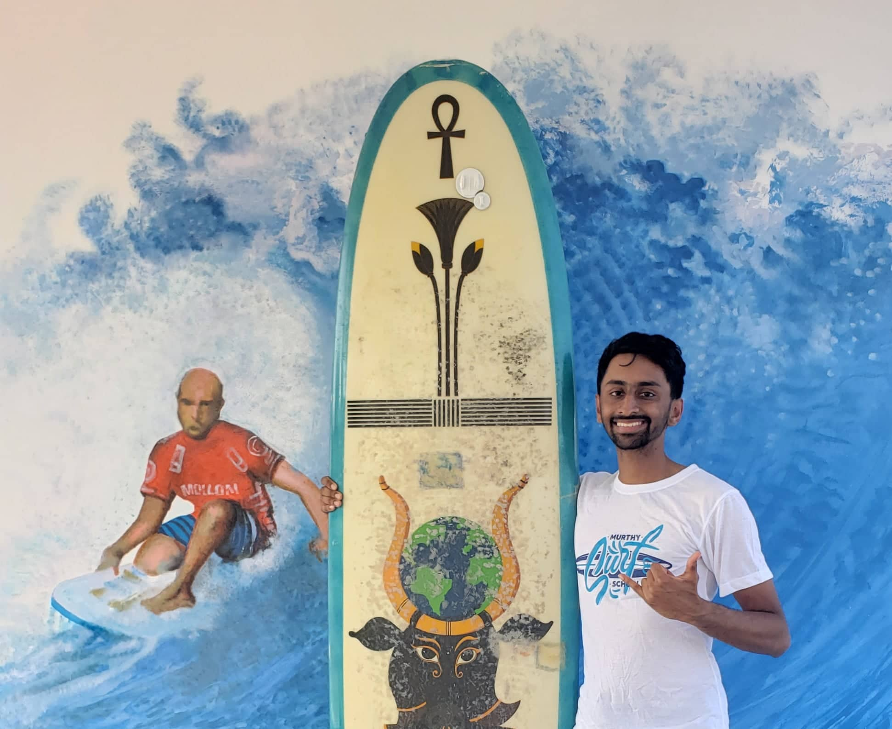

## Speedcubing

{ align=left width=15% style=margin:1em;margin-left:0;margin-top:0.3em;margin-bottom:0.3em }

* I started serious speedcubing in high-school and competed in a variety of 
local/national competitions 
* Developed a variety of my own unique algorithms for to ease memorization and speedsolving.
Solved 3x3 (blind/OH), 4x4, 5x5, megaminx... 

Here is my [**official profile**](https://www.worldcubeassociation.org/persons/2014RAME04)

My notable *unofficial* records are **10.2 sec** (3x3), **19.5 sec** (3x3 OH), 
**1:58 min** (3x3 blind). 

 
## Music

My music tastes mostly span jazz, classic and progressive rock from the 1960s-90s (no, I am not a 65 year-old...). 

<iframe width="23%" src="https://www.youtube.com/embed/kCN0RsQ0cQo" 
 style=margin-left:0;margin-top:0.3em;float:left ></iframe>
<iframe width="23%" src="https://www.youtube.com/embed/dKsA8HzZnQc" 
  style=margin:1em;margin-left:0;margin-top:0.3em;margin-bottom:0.3em;float:left > </iframe>

I play the *guitar*, *piano*, and more recently, the *flute*. Jamming is always a pleasure.
Please reach out to me if interested :)

My music content can be found on my [**YouTube**](https://www.youtube.com/channel/UCQLPzl1LHeF25W3SiKSAqGQ?view_as=subscriber) 
page

***Fun Fact***: I am right-handed, but am a lefty guitarist!
 
 
 
## Sports

{ align=left width=25% style=margin:1em;margin-left:0;margin-top:0.3em;margin-bottom:0.3em }
### Running
I competed in a range of atheletics events, particualarly long distance running (5Ks and 10Ks).
I have been running sub-50 min 10Ks since the age of 15.

### Trekking
High-altitude trekking is the perfect mix of exercise and amazing views! My most notable
hike has been the Annapurna Circuit (120 km, 11 days), peaking at a height of 5400m at the 
age of 14.

{ align=left width=25% style=margin:1em;margin-left:0;margin-top:0.3em;margin-bottom:0.3em }
### Badminton
Badminton has been my primary sport of interest, and I have competed frequently in university,
and state championships back in India.

### Surfing
A more recent endaevor since 2020, I have enjoyed surfing across the globe in various countries.

 
 
