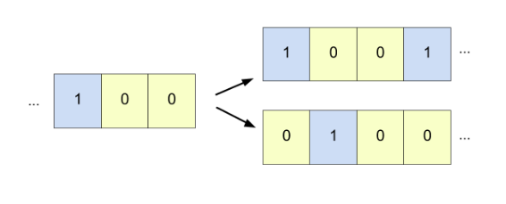

# Projects

## Extending the RISC-V ISA

{ align=left width=20% style=margin:1em;margin-left:0;margin-top:0.3em;margin-bottom:0.3em }

* Custom synthesizable Verilog implementation of RV32-IM core and memory hierarchy
* Added ISA + Microarchitectural extensions to accelerate:
    * Searching in Linear-Probed Hashsets (up to 10x speedup on high load-factors)
    * Breadth-First Search (average 2x speedup) 

&ensp; :octicons-video-16: &nbsp;[**Presentation**](https://vimeopro.com/utece/capstone2021spring/video/543700201)
&emsp;|&emsp; :material-file-document-outline: [**Design**](https://docs.google.com/document/d/1Ygt9UbJ5kYmJLXBvFtrCkNEAzlkYbvzGRgO9i6_9oP4/edit?usp=sharing)
&emsp;|&emsp; :material-github: [**Code**](https://github.com/Patt-Senior-Design/core-design)
&emsp;|&emsp; Team of 2
 
 

---

## Processing-In-Memory: Sorting Algorithms

{ align=left width=20% style=margin:1em;margin-left:0;margin-top:0.3em;margin-bottom:0.3em }

* Surveyed the ability of PIM to accelerate sorting techniques
    * Two base algorithms -- *insertion/radix sort* + *merge* -- showed similar results
    * PIM performed slower than C/C++ quicksort
    * Effect of PIM parameters (DPU-CPU tradeoffs, cache size) are analyzed

&ensp; :material-file-document-outline: &nbsp;[**Presentation**](https://docs.google.com/presentation/d/1zqjP24BIFGV1ArI6x-K1hgJrn6dM-mcpVgXRz3by6Ms/edit#slide=id.p)
&emsp;|&emsp; :material-github: [**Code**](https://github.com/yashparakh111/upmem-dpu)
&emsp;|&emsp; Team of 5
 
 

---

## XC2064 FPGA Design

{ align=left width=20% style=margin:1em;margin-left:0;margin-top:0.3em;margin-bottom:0.3em }

* Fully-synthesizable Verilog design of the XC2064 from 1985
* Created tooling for demonstration
    * Unit tests for LUT and CLB
    * Web GUI for interconnect bitstream generation

&ensp; :material-file-document-outline: &nbsp;[**Reference Article**](https://www.righto.com/2020/09/reverse-engineering-first-fpga-chip.html)
&emsp;|&emsp; :material-github: [**Code**](https://github.com/VLSI-Project/project)
&emsp;|&emsp; Team of 3
 
 

---

## 1D Cellular Automata Theory

{ align=left width=20% style=margin:1em;margin-left:0;margin-top:0.3em;margin-bottom:0.3em }

* Brief survey of local pattern formation in 1D Cellular Automata Theory  

&ensp; :material-file-document-outline: &nbsp;[**Paper**](https://drive.google.com/file/d/1pp3Ui8jZkbUepoJQDvJm0HQ-iSu-Dniv/view)
&emsp;|&emsp; Solo
 
 

---

## RTOS Design

{ align=left width=20% style=margin:1em;margin-left:0;margin-top:0.3em;margin-bottom:0.3em }

* Built a bare-metal RTOS on TM4C123 microcontroller with basic features:
    * Real-time priority scheduler with thread/process management 
    * FAT32 file system and memory management
    * Wireless remote-procedure calls and user interpreter 
* Demonstrated OS robustness with two-player remote battleship application

&ensp; :octicons-video-16: &nbsp;[**Demo**](https://www.youtube.com/watch?v=N1q2bLxdYYM)
&emsp;|&emsp; Team of 2
 
 

---

## JASP Cellular Phone

{ align=left width=20% style=margin:1em;margin-left:0;margin-top:0.3em;margin-bottom:0.3em }

* Supports call+text functionality with total cost under $50
* Integrates a LCD, real-time clock, and numpad on a TM4C123 microcontroller
* Uses LittlevGL library for graphical rendering
* Voted best project during class (EE 445L) project showcase

&ensp; :material-github: [**Code**](https://github.com/JASP-EE445L-Fall19/Phone_4C123)
&emsp;|&emsp; Team of 4
 
 

---

## Enrich: PennApps 2019

{ align=left width=20% style=margin:1em;margin-left:0;margin-top:0.3em;margin-bottom:0.3em }

* Prototype for an interactive course organization and lecturing platform
* Allows for messaging service, speech-to-text translation, and a "learning ratio" statistic 
 to get anonymous real-time feedback about the lecture 

&ensp; :fontawesome-brands-dev: &nbsp;[**Devpost**](https://devpost.com/software/enrich-an-education-platform-to-increase-collaboration)
&emsp;|&emsp; :material-github: [**Code**](https://github.com/arjunramesh99/Enrich)
&emsp;|&emsp; Team of 4
 
 

---

## RecycleMe: CreateAThon 2019

{ align=left width=20% style=margin:1em;margin-left:0;margin-top:0.3em;margin-bottom:0.3em }

* Smart autonomous trash-sorter to sort Recyclable, Landfill, and Compostable materials 
    * Raspberry Pi controls movable compartment with camera to detect new objects
    * A trained CNN runs on offsite server to process data in real-time
* Built a mobile app to crowd-source the gathering and labelling of real-world dataset

&ensp; :material-file-document-outline: &nbsp;[**Presentation**](https://docs.google.com/presentation/d/1hpvU2TW-b8DZ-9Plj63A9ec2fWhC68u3J7fawatYcz0/edit#slide=id.g6349289ee8_0_57)
&emsp;|&emsp; :material-github: [**System Code**](https://github.com/yashparakh111/createathon2019)
&emsp;|&emsp; :material-github: [**Mobile App**](https://github.com/yashparakh111/RecycleMe)
&emsp;|&emsp; Team of 5
 
 

---

## Home-Unity: HackDFW 2019

{ align=left width=20% style=margin:1em;margin-left:0;margin-top:0.3em;margin-bottom:0.3em;margin-bottom:3em }

* Mobile app for homeless users to receive notifications about provisions from the City of 
 Dallas
* Data-visualization web platform for City of Dallas to better understand the 
 urban geography of homelessness
* Awarded first place from City of Dallas and OmniSci under social good category

&ensp; :fontawesome-brands-dev: &nbsp;[**Devpost**](https://devpost.com/software/home-unity-fctb5s)
&emsp;|&emsp; :material-github: [**Code**](https://github.com/yashparakh111/Home-Unity)
&emsp;|&emsp; Team of 5
 
 

---

## ChairIoT: CreateAThon 2018

{ align=left width=20% style=margin:1em;margin-left:0;margin-top:0.3em;margin-bottom:0.3em }

* Prototype for a self-organizing chair platform
    * Raspberry Pi used for processing pipeline and motor control
    * Uses IMU to gather time-series acceleration data and gyroscope data
    * Implemented Kalman filter to compute net displacement
    * Power management components mounted below the platform

&ensp; :material-file-document-outline: &nbsp;[**Proposal**](https://drive.google.com/file/d/1ro5dI3SfT6lGEWr6IyF8sTGZJdI4XTpq/view?usp=sharing)
&emsp;|&emsp; :material-github: [**Code**](https://github.com/yashparakh111/Self-Organizing-Chair)
&emsp;|&emsp; Team of 5

 
 
