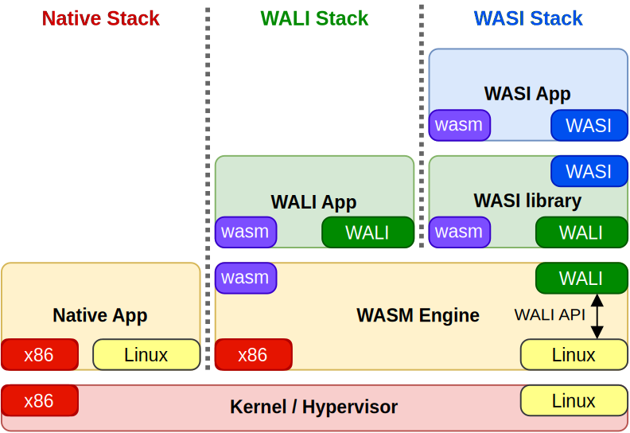
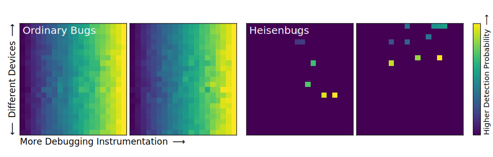
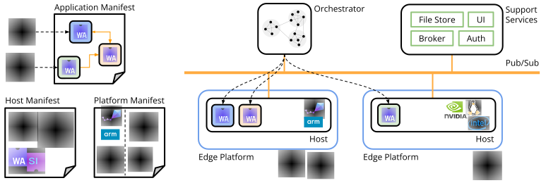

# Publications

## Empowering WebAssembly with Thin Kernel Interfaces

<i><u>Arjun Ramesh</u></i>, Tianshu Huang, Ben L. Titzer, Anthony Rowe

<figure markdown="span">
  { width="400rem" }
</figure>
*Webassembly (Wasm) adoption for new domains is often hindered by the lack of standard system interfaces.
Kernel interface support in Wasm engines allow numerous languages and applications to target Wasm, including 
arbitrary high-level Wasm APIs (WASI), driving ISA portability and software safety down to even deeply embedded 
OS ecosystems*

[:simple-acm: EuroSys 2025](https://doi.org/10.1145/3689031.3717470){ .custom-button }
[:simple-arxiv: Pre-Print](https://arxiv.org/abs/2312.03858){ .custom-button }
[:material-github: WALI](https://github.com/arjunr2/WALI){ .custom-button }
[:material-language-rust: Rust Target](https://doc.rust-lang.org/nightly/rustc/platform-support/wasm32-wali-linux.html){ .custom-button }
<!---
[:simple-arxiv: Arxiv](https://devpost.com/software/enrich-an-education-platform-to-increase-collaboration){ .custom-button }
--->

---

## Unveiling Heisenbugs with Diversified Execution

<i><u>Arjun Ramesh</u></i>, Tianshu Huang, Jaspreet Riar, Ben L. Titzer, Anthony Rowe

<figure markdown="span">
  { width="700rem" }
</figure>
*The detection of quirky Heisenbugs are influenced by numerous factors including (but not limited to) hardware platforms
and, strangely, the extent of instrumentation used by debuggers themselves. 
We propose a debugging methodology that harnesses diversity across platforms 
and the debugger's instrumentation to enable low-overhead debugging at scale.
Tune into the paper for a characterization of over 100 numerous funky bug behaviors!*

[:simple-acm: OOPSLA 2025](https://doi.org/10.1145/3720428){ .custom-button }
[:material-github: Data Artifact](https://doi.org/10.5281/zenodo.14933663){ .custom-button }

---

## Silverline: Lightweight Virtualization and Orchestration of Distributed Systems

<i><u>Arjun Ramesh</u></i>, Tianshu Huang, Emily Ruppel, Dakshina Dasari, Behnaz Pourmohseni, Fedor Smirnov, 
Marco Giani, Paolo Pazzaglia, Charles Shelton, Nuno Pereira, Arne Hamann, Dirk Ziegenbein, Anthony Rowe

<figure markdown="span">
  { width="800rem" }
</figure>
*Real-time cyber-physical systems naturally lend themselves to distributed compute, but are often programmed monolithically to curb complexity 
and safety exploits.
Our framework, Silverline, explores programmability and orchestration of distributed applications transparently
across wide range of hardware using WebAssembly for lightweight virtualization.* 

[:simple-ieee:  RTAS 2025](#){ .custom-button }
[:material-github: Silverline Org](https://github.com/SilverLineFramework){ .custom-button }

---

## Interference-aware Edge Runtime Prediction with Conformal Matrix Completion

Tianshu Huang, <i><u>Arjun Ramesh</u></i>, Emily Ruppel, Nuno Pereira, Anthony Rowe, Carlee Joe-Wong

<figure markdown="span">
  { width="1000rem" }
</figure>
*Performance prediction in heterogeneous edge computing systems is critical for effective resource allocation and cost optimization.
We formulate this problem as matrix completion, which can be extended to handle complex, edge-specific concerns 
such as interference and uncertainty quantification accurately.*

[:simple-acm: MLSys 2025](#){ .custom-button }

---

